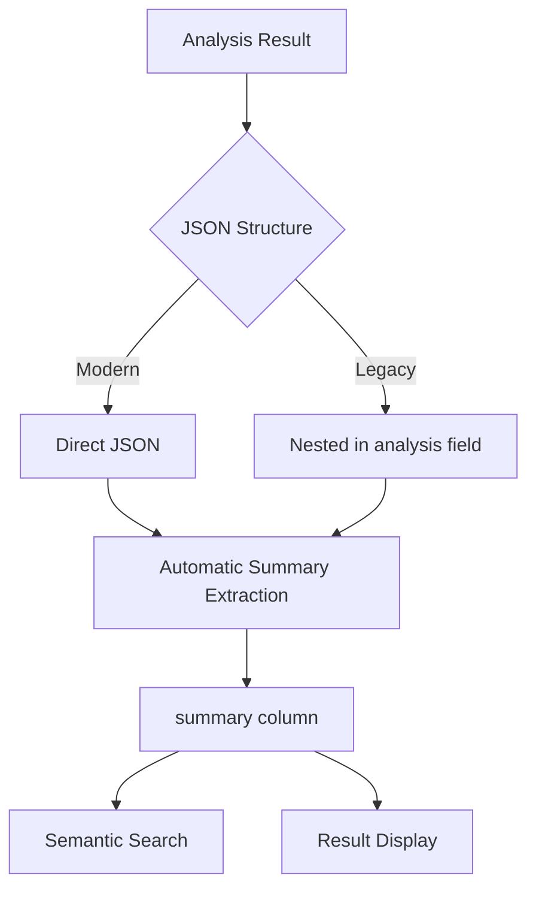

# JSON Handling in Analysis Tasks

## Current JSON Structures
The system can handle two types of JSON structures in the `result` field of `analysis_tasks`:

### 1. Direct Structure (Preferred for New Analyses)

```json
{
  "summary": "A young girl asks Mr Beast for soccer gear...",
  "professionalSkills": ["sports", "coaching"],
  "needs": ["soccer_gear"],
  "tags": ["soccer", "sports", "youth_sports"]
}
```

### 2. Nested Structure (Legacy/External)

```json
{
  "analysis": "```json\n{\n  \"summary\": \"A young girl asks Mr Beast for soccer gear...\",\n  \"professionalSkills\": [\"sports\", \"coaching\"],\n  \"needs\": [\"soccer_gear\"],\n  \"tags\": [\"soccer\", \"sports\", \"youth_sports\"]\n}\n```"
}
```

## Database Handling
The system uses a PostgreSQL function to extract summaries from both structures:

1. First attempts direct access: `data->>'summary'`
2. If not found, tries nested structure:
   - Extracts `analysis` field
   - Removes markdown code blocks
   - Parses inner JSON
   - Extracts summary

## Best Practices

### For New Analyses
When creating new analyses in the app:

```python
# Good - Direct structure
analysis_result = {
    "summary": video_summary,
    "tags": video_tags,
    # ... other fields
}

# Insert into database
supabase.table("analysis_tasks").insert({
    "result": analysis_result,
    # ... other fields
})
```

### For Result Page
The result page's code should use the extracted `summary` column which handles both cases:

```python
# Get analysis with summary
analysis = supabase.table("analysis_tasks")\
    .select("id, result, summary")\
    .eq("id", task_id)\
    .single()\
    .execute()

# Use the extracted summary
summary = analysis.data["summary"]
```

### For Semantic Search
The semantic search feature uses the extracted `summary` column:

```python
# Search across all summaries
results = supabase.rpc(
    'match_videos',
    {
        'query_embedding': query_embedding,
        'match_threshold': 0.5,
        'match_count': 10
    }
).execute()
```

## Migration Notes
- New analyses should use the direct structure
- The system will continue to support nested structures for backward compatibility
- The `summary` column is automatically populated via trigger for both structures
- No manual extraction needed in application code

## JSON Structure Evolution

