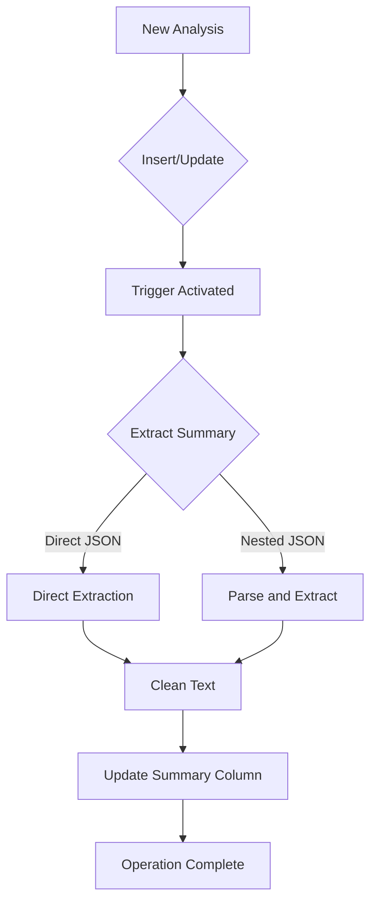

# Automatic Summary Extraction System

## Overview
The system automatically extracts summaries from analysis results and stores them in a dedicated column. This process is handled entirely by the database through triggers and functions.

## Database Structure

### Analysis Tasks Table
```sql
CREATE TABLE analysis_tasks (
    -- other fields...
    result JSONB,        -- Stores the full analysis result
    summary TEXT,        -- Extracted summary
    -- other fields...
);
```

## How It Works

### 1. Automatic Trigger
```sql
CREATE TRIGGER extract_summary_trigger
    BEFORE INSERT OR UPDATE OF result
    ON analysis_tasks
    FOR EACH ROW
    EXECUTE FUNCTION extract_summary_from_result();
```

The trigger activates:
- When a new analysis is inserted
- When the result field is updated
- Before the operation completes (BEFORE trigger)

### 2. Extraction Function
The function handles two JSON structures:

#### Direct Structure (Preferred)
```json
{
  "summary": "This is a direct summary",
  "other_fields": "..."
}
```

#### Nested Structure (Legacy/External)
```json
{
  "analysis": "```json\n{\"summary\": \"This is a nested summary\"}\n```",
  "other_fields": "..."
}
```

### 3. Extraction Process
1. Try direct access: `result->>'summary'`
2. If not found:
   - Extract `analysis` field
   - Remove markdown code blocks
   - Parse inner JSON
   - Extract summary
3. Clean up extracted text:
   - Remove escaped newlines
   - Normalize whitespace
   - Remove surrounding quotes

## Usage Examples

### Inserting New Analysis
```sql
-- Direct structure (preferred)
INSERT INTO analysis_tasks (result) VALUES ('{
    "summary": "Video shows product demonstration",
    "tags": ["product", "demo"]
}');

-- Nested structure (supported)
INSERT INTO analysis_tasks (result) VALUES ('{
    "analysis": "```json\n{\"summary\": \"Video shows product demonstration\"}\n```"
}');
```

### Updating Existing Analysis
```sql
UPDATE analysis_tasks
SET result = '{"summary": "Updated summary"}'
WHERE id = 'task_id';
```

The summary column will be automatically updated in both cases.

## Error Handling
- If summary extraction fails → summary column will be NULL
- Operation continues (non-blocking)
- No error is raised to the application

## Best Practices

### For New Analyses
```python
# Use direct structure
analysis_result = {
    "summary": "Clear summary text",
    "other_fields": "..."
}

# Insert into database
supabase.table("analysis_tasks").insert({
    "result": analysis_result
}).execute()
```

### For Reading Summaries
```python
# Get analysis with extracted summary
analysis = supabase.table("analysis_tasks")\
    .select("id, result, summary")\
    .eq("id", task_id)\
    .single()\
    .execute()

# Use the extracted summary
summary = analysis.data["summary"]
```

## Security
- Function runs with SECURITY DEFINER
- Only authenticated users can execute
- Safe for multi-tenant environments (uses RLS)

## Migration
Existing records can be updated to extract summaries:
```sql
UPDATE analysis_tasks
SET result = result
WHERE result IS NOT NULL;
```

## Flow Diagram
